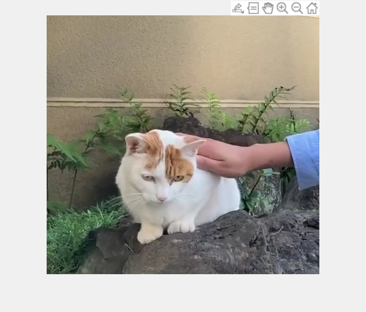

[](https://jp.mathworks.com/matlabcentral/fileexchange/96394-movie2gif)
# Convert movie into gif

This script converts movies into gif file. This demo was created based on MATLAB official document. 

[Japanese]  
このファイルでは、動画をGIFに変換します

What you can do in this script are 

   1.  Convert your movie files into GIF 
   1.  When `isCrop` is set at 1, you can crop the region of interst to save. If you set isCrop=0, you can run this program without the` Image Processing Toolbox`. 
   1.  The parameter ` rate ` controls the number of frames used for the GIF files. Increase this value if you would like to decrease the GIF file. However, the number of frames used is limited, accordingly, the GIF quality might be decreased.  

**Reference**

   1.  [imwrite](https://jp.mathworks.com/help/matlab/ref/imwrite.html): MATLAB official documentation: Write image to graphics file 


```matlab:Code
clear;clc;close all
```

The `movieName` is the movie name to input. Other file types like `avi` and `mov` are also fine. 

```matlab:Code
movieName='sample.mp4';
```

The `filename` is gif name to save

```matlab:Code
filename='output.gif';
```

If you would like to crop the movie, please set `isCrop` at true.

```matlab:Code
isCrop=true;
```

`DelayTime` represents delay before displaying next image, in seconds

A value of `0` displays images as fast as your hardware allows.

```matlab:Code
DelayTime=0.1;
```

The video frame is used for gif for every "`rate`" frames. For example, if you set at 2, the second, forth, sixth, eighth, ... frames are saved as gif. Increasing this parameter decreases the file size of the gif. 

```matlab:Code
rate=2;
```

Create `video object `to read frames from the movie

```matlab:Code
vidObj = VideoReader(movieName);
```

Please specify the area to crop if you want

```matlab:Code
if isCrop==1
    frame = read(vidObj,round(vidObj.NumFrames/2));
    figure;imshow(frame);title('please select the area to save')
    rect=getrect;
    % reset the video object
    vidObj = VideoReader(movieName);
end
```



Loop over the movie to convert into gif

```matlab:Code
idx=1;
while hasFrame(vidObj)
    im = readFrame(vidObj);
    if mod(idx,rate)==1
    if isCrop==1
        im=imcrop(im,rect);
    end
    [A,map] = rgb2ind(im,256);
    if idx == 1
        imwrite(A,map,filename,'gif','LoopCount',Inf,'DelayTime',DelayTime)
    else
        imwrite(A,map,filename,'gif','WriteMode','append','DelayTime',DelayTime);
    end
    end
    idx=idx+1;
end
```
